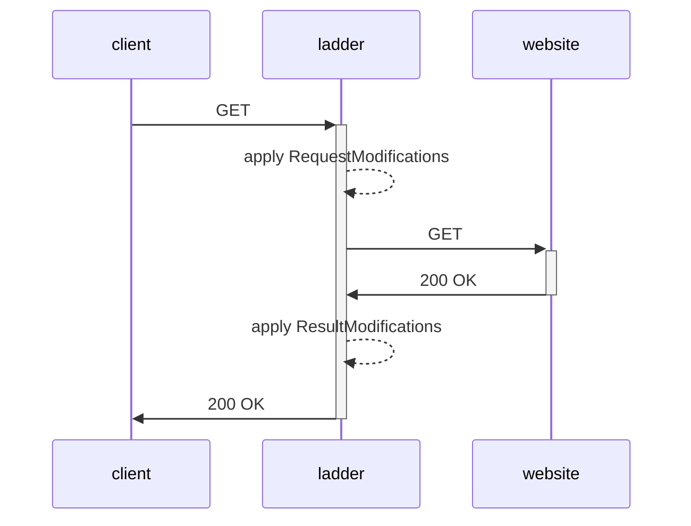

Ladder is a developer tool for testing and analyzing paywall implementations and content delivery behavior on modern websites. It lets you simulate different client environments — such as Googlebot or a custom browser — and observe how a site responds under varying conditions. This makes Ladder useful for debugging paywall configurations, verifying access controls and HTTP headers, and ensuring consistent behavior across different user agents.

## How it works

When you send a request through Ladder, it first applies your configured request modifications (headers, user agent, cookies), then fetches the target site, and finally applies response modifications (HTML rewriting, regex rules, code injection) before returning the result to your browser or API client.

## Key features

<CardGroup cols={2}>
  <Card title="CORS header removal" icon="shield-halved">
    Strip or override CORS, Content-Security-Policy, and other restrictive response headers so proxied pages load without browser security blocks.
  </Card>
  <Card title="Domain-based rulesets" icon="list-check">
    Define per-domain YAML rules to override request headers, inject HTML, apply regex rewrites, and modify URLs before Ladder fetches the target site.
  </Card>
  <Card title="Crawler and bot emulation" icon="robot">
    Send requests with a Googlebot user agent and a forged `X-Forwarded-For` IP address to simulate how search engine crawlers see a page.
  </Card>
  <Card title="HTML injection and regex rewriting" icon="code">
    Inject custom HTML, CSS, or JavaScript into any page position, and apply regex substitutions to the raw response body.
  </Card>
  <Card title="REST API" icon="plug">
    Fetch proxied pages and raw HTML programmatically via the `/api/` and `/raw/` endpoints. See [API overview](/api/overview).
  </Card>
  <Card title="FlareSolverr integration" icon="cloud">
    Route requests for Cloudflare-protected domains through an optional [FlareSolverr](/advanced/flaresolverr) sidecar to solve JavaScript challenges automatically.
  </Card>
  <Card title="Basic Auth protection" icon="lock">
    Secure your instance with HTTP Basic Auth by setting the `USERPASS` environment variable. See [Security](/deployment/security).
  </Card>
  <Card title="Docker, Helm, and binary deployment" icon="server">
    Run Ladder as a Docker container, a Kubernetes Helm release, or a standalone binary on Linux, macOS, or Windows. See [Installation](/installation).
  </Card>
</CardGroup>

## Legitimate use cases

Ladder is intended for legitimate testing, research, and quality assurance purposes only:

- **Debugging paywall configurations** — verify that crawler traffic receives the expected content and that paywalls engage correctly for regular browser traffic.
- **Verifying access controls** — check that HTTP headers, CORS policies, and Content-Security-Policy rules behave as configured across different user agents.
- **Automated testing** — integrate Ladder into CI pipelines to fetch and assert on rendered page content without a headless browser.
- **Content delivery analysis** — observe how a site responds to different `User-Agent` and `X-Forwarded-For` values.

Ladder must only be used in compliance with applicable laws and the terms of service of any target website.

## Limitations

Ladder modifies request headers and rewrites HTML responses, but it does not circumvent all forms of access restriction:

- **Fingerprinting** — sites that detect browser characteristics beyond the user agent (TLS fingerprint, canvas fingerprint, etc.) will still identify automated traffic.
- **Rate limiting** — Ladder does not rotate IPs or introduce delays; sites with rate limiting may block repeated requests.
- **Behavioral analysis** — sites using behavioral bot detection (mouse movement, interaction timing) will not be fooled by Ladder alone.
- **JavaScript rendering** — Ladder fetches HTML directly over HTTP; it does not execute JavaScript. Use [FlareSolverr](/advanced/flaresolverr) for pages that require JavaScript execution to display content.

Third-party tools such as FlareSolverr exist and may be used independently to render web pages in a headless browser environment. Their use may be subject to legal and contractual restrictions. Users are solely responsible for ensuring that their usage complies with all applicable regulations.
